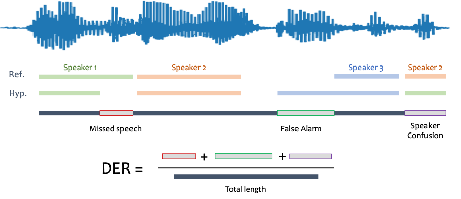
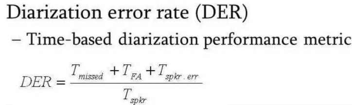

# 🧠 Understanding Speech Diarization and Diarization Error Rate (DER)

## 🗣️ What is Speech Diarization?

**Speech diarization** is the process of segmenting an audio stream into homogeneous sections according to speaker identity — in other words, it answers the question: **“Who spoke when?”**

Diarization is an essential component in multi-speaker audio processing tasks like:
- Meeting and interview transcription
- Conversation analysis
- Speaker indexing and retrieval
 
---

## 📐 Key Components and Mathematics of Diarization

Diarization typically involves the following main stages:

---

### 1. Voice Activity Detection (VAD)

**Goal:** Detect regions in the audio that contain speech.

This is treated as a binary classification task for each audio frame \( i \):

**Speech detection decision rule:**

| Frame \(i\) contains speech? | Output \(y_i\) |
|-----------------------------|----------------|
| Yes                         | 1              |
| No                          | 0              |

Machine learning models (e.g., neural networks, SVMs) are trained on acoustic features like MFCCs, log-Mel spectrograms, or waveform-based representations.

---

### 2. Speaker Embedding Extraction

Once speech segments are identified, embeddings are generated to represent each speaker’s voice in a lower-dimensional space.

Let:
- `x_i`: the audio features from a segment `i`
- `f`: the embedding model (e.g., d-vector, x-vector)
- `e_i`: the resulting embedding

)

\[
\mathbf{e}_i = f(\mathbf{x}_i)
\]

These embeddings are vectors in a high-dimensional space that encode speaker-specific characteristics.

---

### 3. Clustering (Speaker Attribution)

The extracted embeddings are clustered into speaker groups using unsupervised learning.

One common similarity metric is cosine similarity:

\[
\text{sim}(\mathbf{e}_i, \mathbf{e}_j) = \frac{\mathbf{e}_i \cdot \mathbf{e}_j}{\|\mathbf{e}_i\| \|\mathbf{e}_j\|}
\]

Clustering methods include:
- **Agglomerative Hierarchical Clustering (AHC)**
- **Spectral Clustering**
- **K-Means**

Each cluster corresponds to one hypothesized speaker.

---

### 4. Re-segmentation (Optional)

This stage refines speaker boundaries using probabilistic models such as:
- Hidden Markov Models (HMM)
- Viterbi decoding

The goal is to minimize segmentation errors and improve speaker consistency over time.

---

## 📊 Diarization Error Rate (DER)

**Diarization Error Rate (DER)** is the standard metric for evaluating the performance of diarization systems. It measures the **percentage of total speaker time** that is incorrectly attributed.

DER accounts for:
- **Missed speech (Miss)**: Speech in reference not detected by the system.
- **False alarm (FA)**: Non-speech or incorrect segments falsely marked as speech.
- **Speaker error (Confusion)**: Speech attributed to the wrong speaker.

 

DER = (T_miss + T_fa + T_err) / T_ref

DER = (T_miss + T_fa + T_err) / T_ref

Where:

T_miss : Duration of missed speech  
T_fa   : Duration of false alarm speech  
T_err  : Duration of speaker confusion  
T_ref  : Total duration of reference speaker segments

---

---
